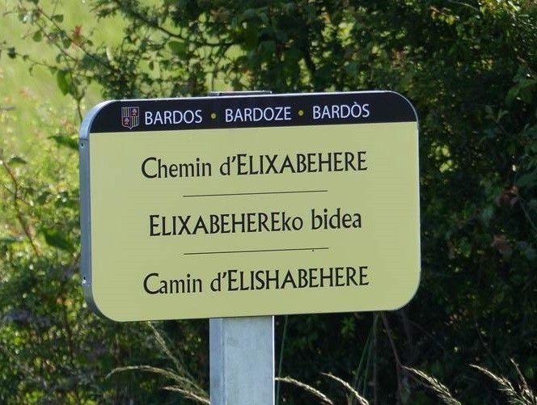

### Géocoder effectivement avec
# BANO et Addok

### SotM FR 2024

Frédéric Rodrigo - Cartoway

frederic@cartoway.com

---

# Geocodons !

- Oui mais avec la BANO
  - Le meilleur des deux mondes ?
- Avant d'aller sur le terrain
  - Qualité et niveau de confiance très importantes

---

# [Addok](https://github.com/addok/addok)

API de géocodage

- Indexer les adresses
- Recherche & autocomplétion plein texte
  - score : similarité entre recherché et trouvé
- Support de plugins

----

## Plugins par défaut

```python
PROCESSORS_PYPATHS = [
"addok.helpers.text.tokenize",
"addok.helpers.text.normalize",
"addok_france.glue_ordinal",
"addok_france.fold_ordinal",
"addok_france.flag_housenumber",
"addok.helpers.text.synonymize",
"addok_fr.phonemicize",
]
QUERY_PROCESSORS_PYPATHS = [
'addok.helpers.text.check_query_length',
'addok_france.extract_address',
'addok_france.clean_query',
'addok_france.remove_leading_zeros',
]
SEARCH_RESULT_PROCESSORS_PYPATHS = [
"addok.helpers.results.match_housenumber",
"addok.helpers.results.score_by_importance",
"addok.helpers.results.score_by_autocomplete_distance",
"addok.helpers.results.score_by_ngram_distance",
"addok.helpers.results.score_by_geo_distance",
]
```

---

## 1 Addok, 1 Langue, 1 Pays

Spécificités :
- Format de l'adresse
- Langue : synonyme, nettoyage
- Phonétisation

----

## France

- [addok_france_clean](https://github.com/cartoway/addok_france_clean) Règles supplémentaires de nettoyage de la recherche
  - <del>porte</del>, <del>étage</del>, <del>burreau</del>...
- [addok_usage_name_BAN_FR](https://github.com/cartoway/addok_usage_name_BAN_FR) Ne pas pénaliser les versions courtes des noms de ville
  - `Brive-la-Gaillarde` = `Brive`

- Plus [conversion au format Addok+BAN](https://github.com/cartoway/geocoder-api/blob/master/docker/builder/initialize-fr.sh) de la BANO
  - type BAN != type BANO
    - (city➡municipality, town➡municipality, village➡municipality, place➡locality...)

----

## Espagne

Alternatives aux plugins France/Français pour l'Espagne/l'espagnol(+basque+catalan+galicien)
- [addok-es](https://github.com/cartoway/addok-es) Espagnol
- [addok-spain](https://github.com/cartoway/addok-spain) Espagne
- Plus [conversion au format Addok+BAN](https://github.com/cartoway/geocoder-api/blob/master/docker/builder/initialize-es.sh) de la base d'adresse de l'Espagne

----

## Luxembourg

Alternatives aux plugins France/français pour le Luxembourg/<del>luxembourgeois</del>
- [addok_luxemburg](https://github.com/cartoway/addok_luxemburg)
- [addok_luxemburg_clean](https://github.com/cartoway/addok_luxemburg_clean)
- [addok_usage_name_LU](https://github.com/cartoway/addok_usage_name_LU)
- Plus [conversion au format Addok+BAN](https://github.com/cartoway/geocoder-api/blob/master/docker/builder/initialize-lu.sh) de la base d'adresse du Luxembourg

---

## Géocodage d'adresses structurés

💡 Profiter de la segmentation pour améliorer le résultat

----

## Plugin [addok_search2steps](https://github.com/cartoway/addok_search2steps)

- Recherche la commune et le code postal
- Pour chaque résultat
  - Recherche le numéro et la rue dans cette commune
  - ➡ Force la cohérence du résultat
  - ➡ Ne garder que la ville si la voie non retrouvée
- À défaut : recherche classique plein texte, minoré

----

## Plugin : Score faux négatifs

[addok_score_preprocessed_query](https://github.com/cartoway/addok_score_preprocessed_query)

- Éviter les scores faussement faibles
- Scorer les résultats avec la chaîne de recherche nettoyé et non celle d'origine.

---

# Noms multiples



----

## Noms multiples

Géocoder = retrouver l'adresse

- même si c'est l'ancien nom de la voie ou de la commune
- même si la voie à plusieurs noms
- ...

----

## Noms multiples

Sauf que la doctrine Addok & BAN / BANO

1 voie = 1 nom

- Support multi-noms dans Addok
  - ➡ dédoubler les lignes
- Support multi-noms dans BANO ?

----

## Noms multiples dans BANO

Objectifs différents
- BANO : 1 nom, valider choérence OSM ⬌ BAN/Cadastre...
- Géocodage : retrouver une addresse depuis tous les noms possibles

➡ alors on forke (gentiment) !

----

# Breaking news !
## Noms multiples dans les BAL

[Les BAL passent en multilingue](https://social.numerique.gouv.fr/@adressedatagouv/112535272731408464)

[Bientôt la BAN également en multilingue](https://github.com/BaseAdresseNationale/ban-plateforme/issues/408)

---

# Contribuer à BANO

Difficulté de contribuer à titre pro à un projet communautaire quasi uni-personnel.

Différence de rapport au temps disponible et méthode de travail.

----

## Exécuter BANO

Difficultés de monter une nouvelle instance BANO pour un projet dont il n’existe qu'une seule instance.

- Manque de documentation
- Besoin de faciliter le setup

----

## Proposition d'amélioration

- Fix pour pouvoir lancer BANO de bout en bout
- Stopper les scripts bash et SQL à la première erreur rencontrée
- Exécution que sur une partie des départements

----

## Proposition de changements

- Base de données : passer de 2 à 1
- Docker : pour faciliter l'installation et la prise en main
- Python : passer d'un module à installer à un script
- Procédure d'exécution de bout en bout

----

## alors on forke (gentiment)

➡ tout ça déjà fait sur un [fork](https://github.com/frodrigo/bano/tree/docker)

- Création de pull requests pour améliorer le projet
  - [PR](https://github.com/osm-fr/bano/pulls) en cours sur les modifications les plus basiques
- Avant de pouvoir proposer des modifications plus importantes
  - Difficulté d'intégration : rapport pro / bénévole
  - Problématique de maintien d'un fork en parallèle

----

## proposition d'amélioration (divergente)

➡ déjà fait sur le fork

(tout ça pour ça)

- support des noms alternatifs et multilingues
  - ex : old_name, alt_name, name:eu...

----

## BANO et au de là
### La BAÏO ?

- Séparer l’extraction des adresses OSM du rapprochement BAN/Cadastre
  - Rapprocher d'autres bases d'adresses

---

### Géocoder effectivement avec
# BANO et Addok

- [Plugins Addok](https://github.com/orgs/cartoway/repositories?q=addok)
  - Amélioration du géocodage
  - Support des adresses structurées
  - Support du Luxembourg et de l'Espagne
- [BANO multi-noms et avec Docker](https://github.com/frodrigo/bano/tree/docker)
